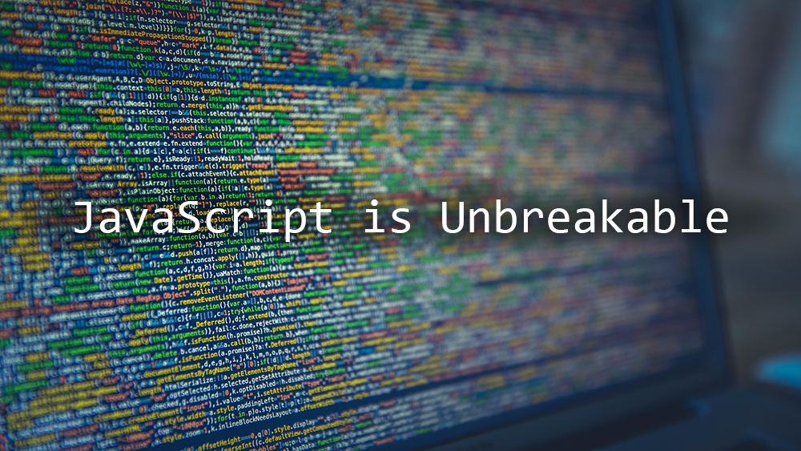

Before taking Software Engineering at UH Manoa in 2016, I had never coded in JavaScript even though I'd encountered it frequently in the wild due to its incredible popularity. My previous experience was mostly with Java, C, and C++ as part the the Manoa curriculum and JavaScript was a departure from that traditional machine-oriented, compiled structure. There is a definite adjustment period, but after going through CodeAcademy and FreeCodeCamp's resources, I think I understand why it's so popular.

A friend once described the language as "slapdash," and I definitely agree with that description. Coming fresh from a punishing language like C, I've found that JavaScript is extremely difficult to break. It has a very forgiving syntax (semicolons or no? Whatever) and it's also very forgiving in terms of how much thought has to be put into it before it is ever deployed, since nearly everything can be adjusted during runtime. The language's flexibility really creates a lot of opportunities for creative solutions, like how the multi-type arrays allow the programmer to return multiple variables at once, which creates one of the many workarounds for C++'s pass-by-reference structure.

I'm still learning about the language, but I do worry about the lack of rigorousness. If a team isn't disciplined, JavaScript's flexibility can lead to hacky solutions that are difficult for project managers and collaborators to track. This is especially troublesome with JavaScript's tendency to opt for graceful and quiet coercion of types and objects...good luck ever knowing what `this` refers to. However, with its exploding popularity and large body of open source projects, I suspect those fears are probably overstated over the long term, as solutions are being implemented in ES6 and beyond.

JavaScript's flexibility also makes Dr. Johnson's "athletic software engineering" sprints a lot more fun than I thought they would be. I was initially skeptical of the high-pressure approach to coding, but as I've done a few, the challenge of completing entire programs in minutes has grown on me. While I don't think the solutions created are optimal, and I often think about more elegant solutions as I'm implementing the first idea that came to me, I like the challenge of thinking through a problem and implementing a solution as quickly as possible, which shows how much can be accomplished in a short amount of time.

JavaScript is definitely an exciting language though, and its accelerating adoption in all areas of computer science bodes well for its usefulness as an essential tool in any developer's tool kit.
