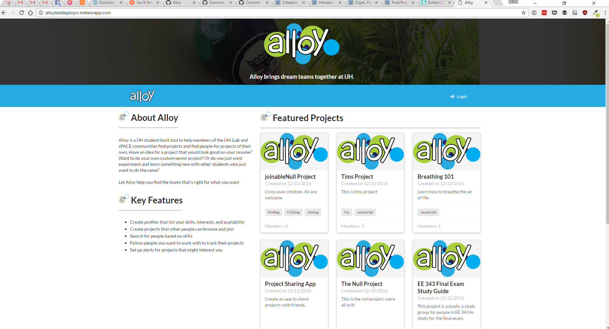

In late 2016, I took a software engineering course at the University of Hawaii at Manoa with Professor Philip Johnson. The end goal of the class was to develop a full web app based on the Meteor stack. I [pitched a concept](https://spyhi.github.io/essays/project-teambuilder.html) for an application that helps build teams around skills for a project, which became *Alloy.*

After conducting user interviews, we identified that recruiting people who were interested in pursuing passion projects was indeed a pain point that remained unsolved, but that the primary issue was that project were not being seen, so as a team, we decided to build a system that would put project discovery front and center, so the process of finding a team or finding a project would be as frictionless as possible.

Alloy connects people through skills, and is organized around projects. The service uses a "skill graph" that powers our recommendation engine, which serves relevant projects through the user's home page, which means users don't have to make an effort to search for interesting projects, and creators can rest assured that their projects will get seen...featured projects are even shown before a user ever logs in! All this means that Alloy is a frictionless way to find teams.

The project was built in approximately three weeks.

The people who worked with me on the project are:
* [Timothy Byers](https://byerst.github.io/) (Back end)
* [Allie Kim](https://alliekim.github.io/) (User Interface)
* [Neil Teves](https://neilnthings.github.io/) (Search and usability)
* [Reed Villanueva](https://reedv.github.io/) (Database, API, integration)

[See the "About Alloy" page to learn more](https://alloyteams.github.io/)
